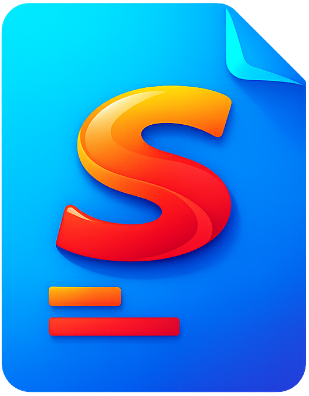

<div align="center">



# Summie

**A distraction-free document editor built for students.**

[](https://github.com/ThermedWolf/Summie-Docs/releases)
[](LICENSE)
[](#installation)
[](https://www.electronjs.org/)

[Download](https://github.com/ThermedWolf/Summie-Docs/releases/latest) · [Features](#features) · [Getting Started](#getting-started)

</div>

---

Summie started as a simple app for writing study summaries — and grew into a full-featured word processor. It has a clean writing environment, a built-in glossary (_begrippen_) that highlights terms live in your document, internal references, syntax-highlighted code blocks, and a dedicated flashcard learning mode. Documents are saved in a native `.sumd` format and can be exported to `.docx`. Vibe-coded with ❤️.

## Features

###  Writing & Editing

- **Rich text editor** with support for headings, bold, italic, underline, font sizes, and text color
- **Two document modes** — single continuous page or paginated multi-page layout
- **Tables** with interactive controls for adding/removing rows and columns
- **Images** with drag-and-drop support and inline editing
- **Syntax-highlighted code blocks** supporting 19 languages (JavaScript, Python, TypeScript, SQL, Rust, Go, and more)
- **Word count** displayed live in the sidebar

###  Glossary (_Begrippen_)

- Define terms with a keyword, description, and optional aliases
- Terms are automatically **highlighted throughout your document** as you write
- Autocomplete suggestions appear as you type recognized keywords
- A live **begrippen counter** shows how many glossary terms are present in the document

###  Internal References

- Link any named reference to a target element in the document — text selections, images, tables, or code blocks
- Hovering a reference word shows a **live preview tooltip** of the linked section
- Click to jump directly to the referenced element

###  Learning Mode

- Open your saved `.sumd` file in the dedicated **learning module**
- Select which glossary terms you want to practice
- Study with **flashcards** or a **fill-in-the-blank practice mode**
- Progress tracker built in

###  File Management

- Native **`.sumd` file format** with full save/open support
- **Export to `.docx`** (Word document) — preserves formatting, headings, code blocks, tables, and glossary highlights
- Recent documents list on the home screen with rename, delete, and "Show in Explorer" options
- Auto-save indicator for unsaved changes

###  Other Tools

- **Document outline** (inhoudsopgave) in the sidebar — auto-generated from headings, with scroll tracking
- **Find & search** within the document
- Frameless window with custom minimize / maximize / close controls

## Installation

Download the latest release for your platform from the [Releases](https://github.com/ThermedWolf/Summie-Docs/releases/latest) page:

| Platform                                                                                                            | Format           |
| ------------------------------------------------------------------------------------------------------------------- | ---------------- |
|  Windows | `.exe` installer |
|  macOS               | `.dmg`           |
|  Linux           | `.AppImage`      |

### Build from Source

Requires [Node.js](https://nodejs.org/) v18+.

```bash
git clone https://github.com/ThermedWolf/Summie-Docs.git
cd Summie-Docs
npm install

# Run in development
npm start

# Build for your platform
npm run build

# Build for a specific platform
npm run build:win
npm run build:mac
npm run build:linux
```

Output is placed in the `dist/` directory.

## Getting Started

1. Launch Summie — you'll land on the home screen
2. Click **Nieuw Document** to create a new document (single page or paginated)
3. Use the toolbar to apply headings and formatting
4. Open the sidebar to manage your **Begrippen** (glossary terms) — they'll highlight automatically in your text
5. When you're ready to study, open your `.sumd` file from the **Leren** (learning) screen
6. Export to `.docx` any time via the file menu

## File Format

Summie saves documents as `.sumd` files — a JSON-based format that stores your document HTML, glossary, references, and metadata. These files can be reopened in Summie and exported to `.docx`.

## Tech Stack

- **[Electron](https://www.electronjs.org/)** — cross-platform desktop shell
- **[electron-builder](https://www.electron.build/)** — packaging and distribution
- **[docx.js](https://docx.js.org/)** — `.docx` export

## License

MIT © [ThermedWolf](https://github.com/ThermedWolf)
